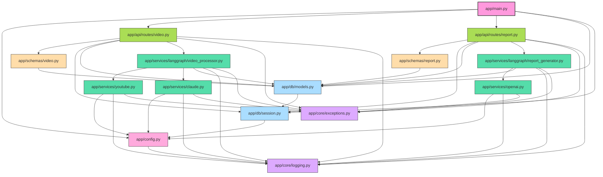

version:
https://github.com/RiSEblackbird/_youtube-content-processor/tree/35c163240beb99666439429b73bc0e80630955bf

prompt:
```
@Codebase プロジェクト全体に対してpythonモジュールの相関関係を図示してください。
```

---

# モジュール相関関係図



# アプリケーションモジュール構成の説明

## コアモジュール
- **app/main.py**: アプリケーションのエントリーポイント。FastAPIインスタンスを作成し、ルーターを登録します。
- **app/config.py**: 環境変数から設定を読み込み、アプリケーション全体で使用する設定を提供します。

## APIレイヤー
- **app/api/routes/video.py**: 動画処理に関するエンドポイントを定義します。
- **app/api/routes/report.py**: レポート生成と取得に関するエンドポイントを定義します。

## サービスレイヤー
- **app/services/youtube.py**: YouTube APIとの連携を担当し、動画メタデータと文字起こしを取得します。
- **app/services/claude.py**: Claude APIを使用して動画コンテンツを分析します。
- **app/services/openai.py**: OpenAI APIを使用してレポートを生成します。

## LangGraphモジュール
- **app/services/langgraph/video_processor.py**: 動画処理のワークフローを管理するLangGraphを実装します。
- **app/services/langgraph/report_generator.py**: レポート生成のワークフローを管理するLangGraphを実装します。

## データアクセスレイヤー
- **app/db/models.py**: SQLAlchemyのORMモデルを定義します。
- **app/db/session.py**: データベース接続とセッション管理を行います。

## スキーマ
- **app/schemas/video.py**: 動画関連のPydanticスキーマを定義します。
- **app/schemas/report.py**: レポート関連のPydanticスキーマを定義します。

## コア機能
- **app/core/logging.py**: アプリケーション全体のロギング設定を提供します。
- **app/core/exceptions.py**: カスタム例外クラスを定義します。

この構造により、各モジュールは明確な責任を持ち、依存関係が整理されています。特にLangGraphモジュールは、複雑な処理フローを管理するための中心的な役割を果たしています。